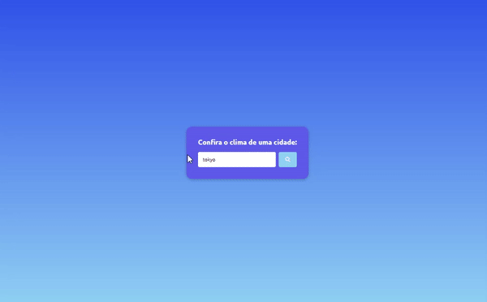
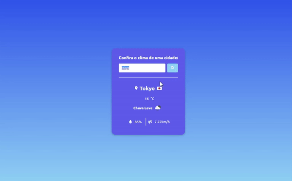
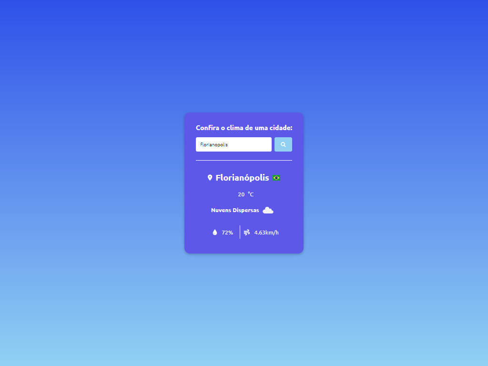

# CLIMA DAS CIDADES🌤

Escolha uma cidade de sua preferência e descubra como está indo o clima na mesma

## 🔴DESCRIÇÃO

Projeto feito apenas com html/css e javascrip puro.✔

API USADA: <a target="_blank" href="https://openweathermap.org/api">https://openweathermap.org/api</a>

## 🔴FUNCIONAMENTO DEMONSTRADO!

Aqui a primeira interação com a aplicação logo após ser iniciada!❗

Mostro uma mudança de cidade por pesquisa, e também me utilizo do submit com Enter!🤞

ADICIONAL

